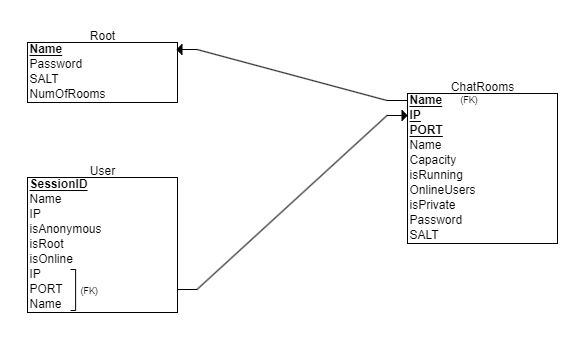

# AnonyChat
AnonyChat is a graphical user interface (GUI) based chat application that enables users to connect and communicate in a secure and user-friendly environment. Designed with a focus on privacy chatting, it provides essential functionalities for both regular users and server root, ensuring private and safe communication.

🔐 **Important**: Read the "ChatServer&&Client with SSL/TLS Encryption" section below to understand how Anonychat ensures privacy through SSL/TLS encryption.

## 📊 AnonyChat RSD


## 📊 AnonyChat RSD


## 🚀 How to Run

### Prerequisites
- Ensure you have **Java** installed on your system. 
- Java Development Kit (JDK) V17-20.
- You can download from [Oracle's Java website](https://www.oracle.com/java/technologies/javase/jdk20-archive-downloads.html).

### Windows
1. Download the AnonyChat.exe file.
2. Double-click on AnonyChat.exe to run the application.

### Mac and Linux
1. Download the Anonychat.jar file.
2. Open your terminal.
3. Navigate to the directory where you downloaded AnonyChat.jar.
4. Run the program using the command: `java -jar AnonyChat.jar`.

## 🔒 ChatServer&&Client with SSL/TLS Encryption

This repository contains a Java chat server application with added SSL/TLS encryption for secure data transmission. Below are the instructions to set up and run the server with SSL/TLS encryption.

### Prerequisites

- Java Development Kit (JDK) V17-20
- Access to command line tools or terminal

### Generating a Keystore and SSL Certificate

1. Generate a self-signed SSL certificate using Java's keytool utility. For production, obtain a certificate from a trusted Certificate Authority (CA).

   ```shell
   keytool -genkey -keyalg RSA -alias selfsigned -keystore keystore.jks -storepass password -validity 360 -keysize 2048
   ```

   Replace `keystore.jks` and `password` with your desired keystore filename and password.

### Server Setup

1. **Import SSL Classes**

   Modify your server code to use SSL classes:

   ```java
   import javax.net.ssl.SSLServerSocketFactory;
   import javax.net.ssl.SSLServerSocket;
   ```

2. **Modify Server Socket**

   Update the server socket creation in the `start` method to use SSL:

   ```java
   SSLServerSocketFactory ssf = (SSLServerSocketFactory) SSLServerSocketFactory.getDefault();
   server = (SSLServerSocket) ssf.createServerSocket(port);
   ```

3. **Configure System Properties**

   Set the system properties for the keystore in your code or as JVM arguments:

   - In code:

     ```java
     System.setProperty("javax.net.ssl.keyStore", "path/to/keystore.jks");
     System.setProperty("javax.net.ssl.keyStorePassword", "password");
     ```

   - As JVM arguments:

     ```
     -Djavax.net.ssl.keyStore=path/to/keystore.jks -Djavax.net.ssl.keyStorePassword=password
     ```

### Client Configuration

- Ensure that your client application also supports SSL. Use `SSLSocket` and `SSLSocketFactory` for client-side socket connections.
- For self-signed certificates, configure the client to trust the server's certificate. For production with a CA-issued certificate, this is usually not needed.

## 🌍 Converting Local IP to Global IP

### Running on a Server

1. **Choose a Hosting Service**: Select a cloud hosting service like Amazon AWS, Google Cloud, or Microsoft Azure. These services typically offer virtual machines where you can deploy your applications.

2. **Set Up the Server**: Follow the hosting service's instructions to set up a virtual machine. Install Java and any other necessary software on the server.

3. **Deploy AnonyChat**: Upload the AnonyChat server application to the cloud server. You can do this through FTP, SSH, or any other method provided by the hosting service.

4. **Configure Security Settings**: Make sure to configure the server's security settings to allow traffic on the port used by AnonyChat (e.g., port 8080).

5. **Start AnonyChat**: Run the AnonyChat server application on the cloud server. The server's public IP address can now be used to access AnonyChat globally.

### Opening a Port in Your Router

1. **Access Router Settings**: Open your router's configuration page. This is usually done by entering the router’s IP address in a web browser.

2. **Locate Port Forwarding Settings**: Find the port forwarding section in the router settings. This might be under sections like 'Advanced', 'Network', or 'Security'.

3. **Configure Port Forwarding**: Create a new port forwarding rule. Enter the local IP address of the computer running AnonyChat, and specify the port used by AnonyChat (e.g., port 8080). Set the external port to the same value.

4. **Save and Apply Changes**: Save the settings and reboot the router if necessary.

5. **Public IP**: Your public IP address is now the global access point for the AnonyChat server.
   

## ⚠️ Antivirus Notification
Some antivirus software might flag AnonyChat as a potential virus or trojan. This is a false positive, likely due to the network communication features used in the program. If you encounter this issue, you may need to create an exception in your antivirus software for AnonyChat.
